<p align="center">
  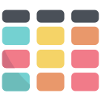
</p>

<h1 align="center">GoalBoard</h1>

<p align="center">
  <strong>The connected workspace for teams & individuals.</strong><br/>
  Manage goals, tasks, and projects with beautiful Kanban boards — right in your browser.
</p>

<p align="center">
  
  
  
  
</p>

---

## 📸 Screenshots

### Landing Page

The public-facing landing page — the first thing visitors see. Features hero section, feature highlights, social proof, and call-to-action buttons.

<p align="center">
  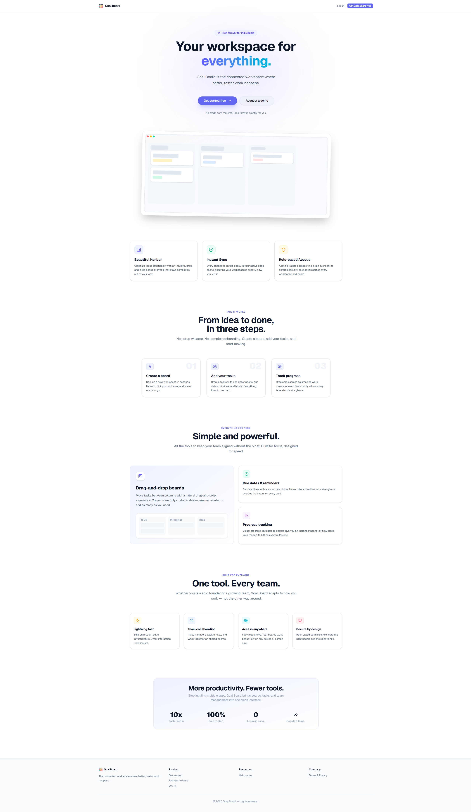
</p>

### Registration

Create a new account with username, email, and password. The first registered user automatically becomes Admin. Includes real-time Zod validation.

<p align="center">
  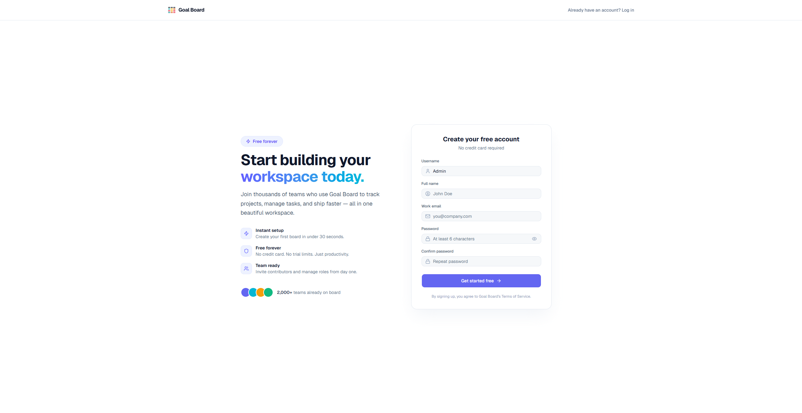
</p>

### Login

Sign in with your email and password. Authenticated users are redirected to the Dashboard.

<p align="center">
  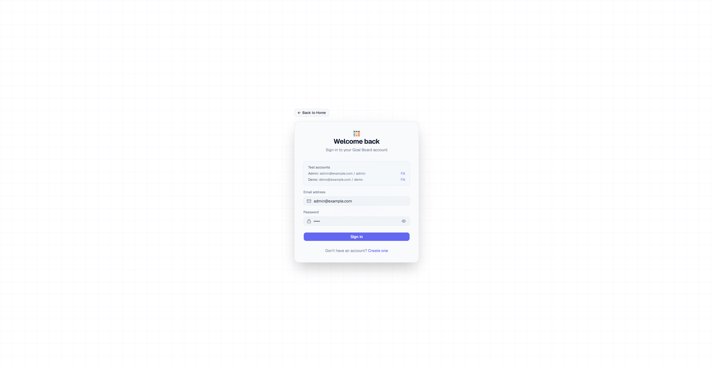
</p>

### Request Demo

Public form for visitors to request a guided demo. Admins can review, approve, and seed a fully populated demo project.

<p align="center">
  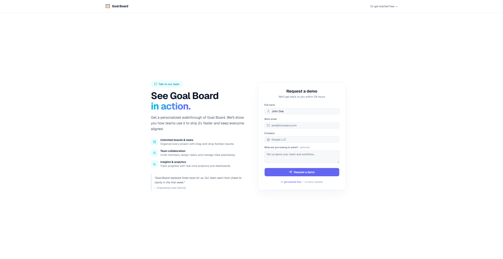
</p>

### Dashboard

Central hub after login — view all your boards with progress stats, overdue task alerts, and switch between multiple view modes (Grid, List, Table, Recent, Timeline).

<p align="center">
  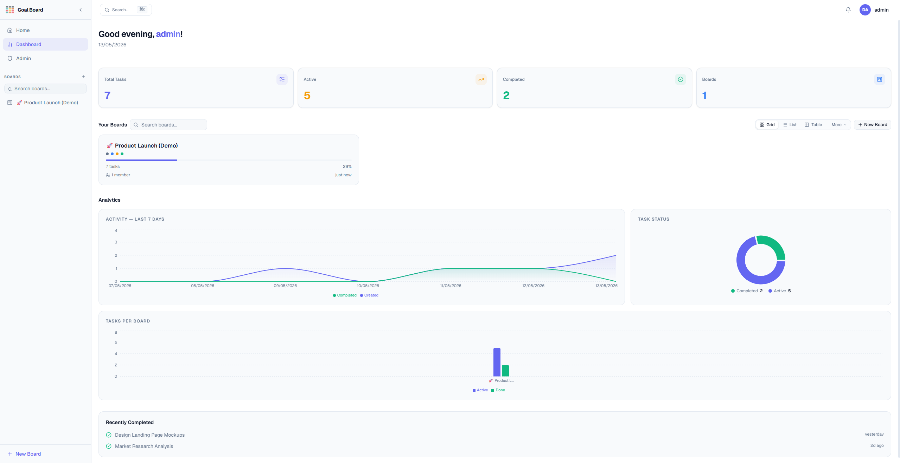
</p>

### Board

Drag-and-drop task management with customizable columns, priority labels, assignees, due dates, budget tracking, and a rich task detail dialog.

<p align="center">
  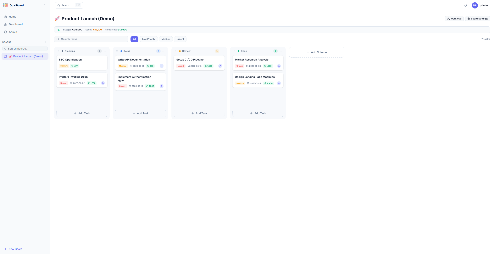
</p>

### Add New Task

Create tasks with titles, rich Markdown descriptions (Tiptap editor), multiple priority levels, assignees, due dates, and cost tracking.

<p align="center">
  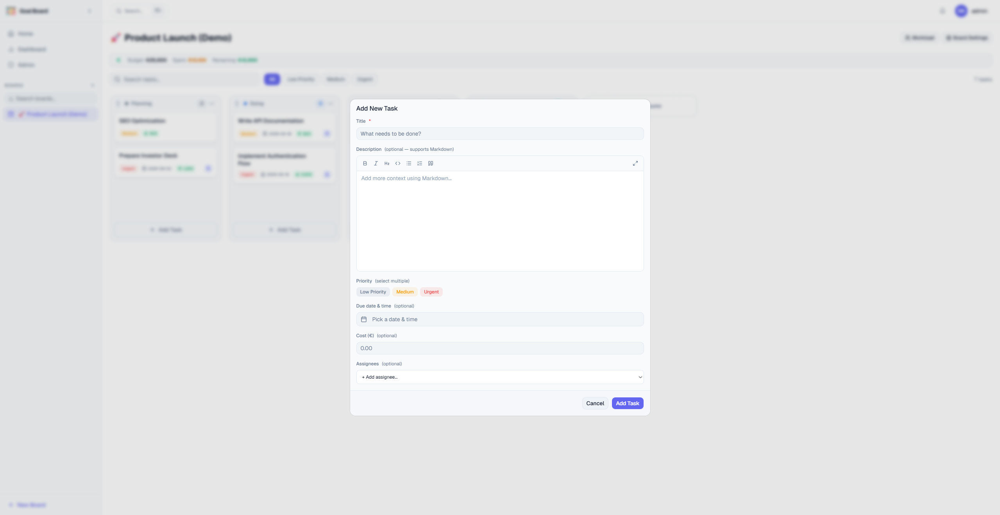
</p>

### Workload Tracker

Visualize task distribution across board members with detailed workload analytics. Shows per-member task counts by column, completion rates, and cost breakdowns — available to board owners and granted contributors.

<p align="center">
  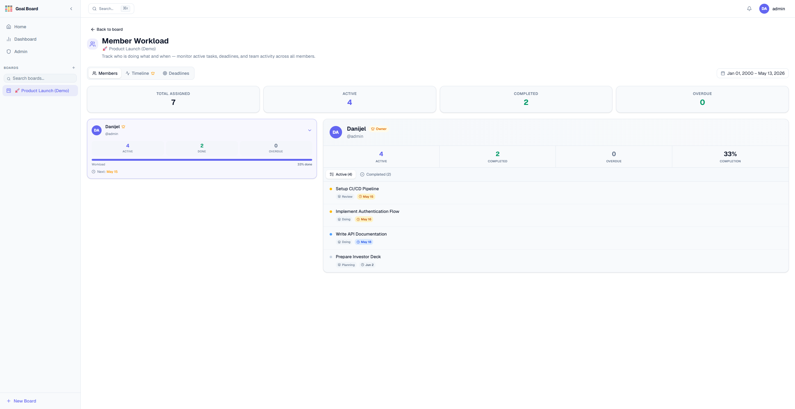
</p>

### Settings

Update your profile, upload and crop an avatar, edit your bio, and manage account information.

<p align="center">
  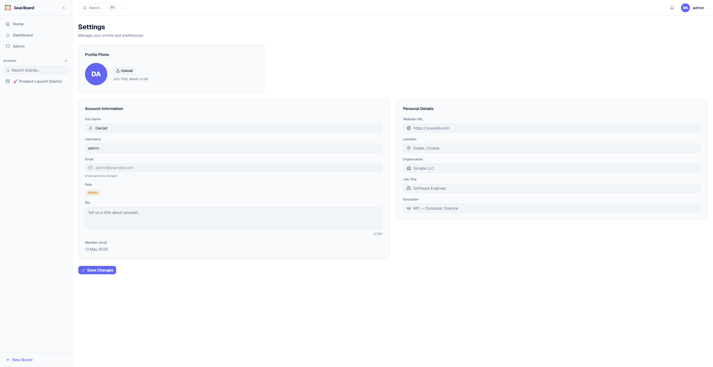
</p>

### Admin Panel

Manage users, roles, and demo requests. Admin-only access with full RBAC permission gating.

<p align="center">
  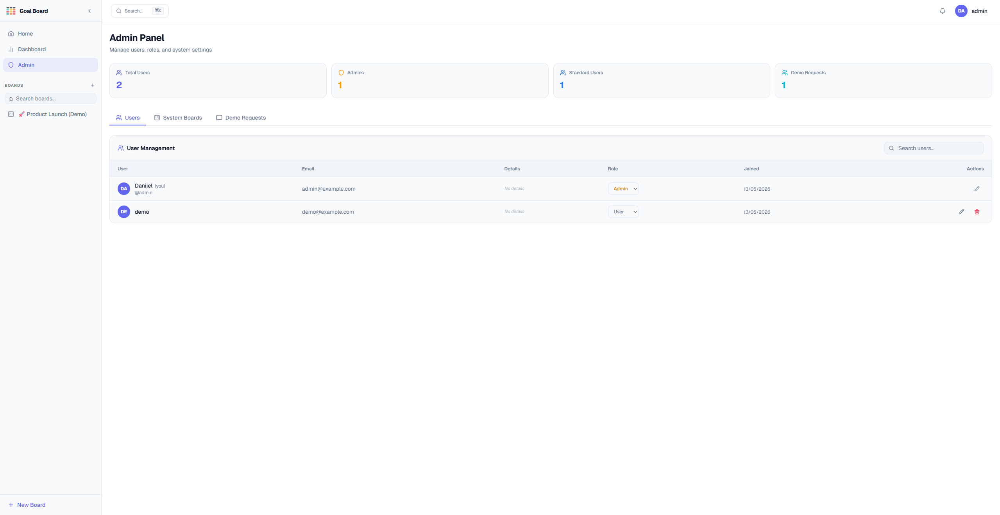
</p>

---

## ✨ Features

### Core

- **Boards** — drag-and-drop tasks across fully customizable columns using dnd-kit
- **Multiple Boards** — create, rename, delete, and pin boards per project
- **Rich Task Details** — Markdown descriptions (Tiptap), due dates, multiple priorities, cost tracking, multi-assignee support
- **Task Lifecycle** — create → assign → move → complete → archive → restore → permanently delete
- **Budget Tracking** — set per-board budgets and track spending across tasks in real-time

### Dashboard & Views

- **Dashboard Overview** — aggregated stats, progress charts (Recharts), and overdue task alerts
- **5 Board Views** — Grid, List, Table (sortable), Recent, and Timeline
- **View Persistence** — selected view is saved to localStorage

### Collaboration

- **Board Invitations** — invite members via email, accept/decline from the notification bell
- **Member Roles** — owner, contributor, and viewer with per-board role management
- **Workload Tracker** — visualize task distribution and member workload per board
- **Real-time Notifications** — task assignments, invitation responses, role changes, member events

### Navigation & UX

- **Command Palette** — quick navigation and board creation with `Ctrl+K` / `⌘K`
- **Collapsible Sidebar** — with board search, auto-collapse on mobile
- **Responsive Design** — fully functional on desktop, tablet, and mobile
- **Smooth Animations** — Framer Motion page transitions and micro-interactions

### Security & Admin

- **Role-Based Access Control (RBAC)** — admin and user roles with a centralized permission map
- **Admin Panel** — manage all users, change roles, review and grant demo requests
- **Password Hashing** — bcryptjs
- **Permission-Gated Routes** — `<ProtectedRoute>` component with fallback redirects

### Settings

- **Profile Management** — username, full name, bio, website, location, organization, job title, education
- **Avatar Upload** — with interactive crop dialog (react-easy-crop)
- **Form Validation** — Zod schemas + React Hook Form with real-time error feedback

---

## 🛠 Tech Stack

| Layer                | Technology                 | Purpose                                             |
| -------------------- | -------------------------- | --------------------------------------------------- |
| **UI Framework**     | React 19 + Vite 8          | Component-based SPA with fast HMR                   |
| **Routing**          | React Router 7             | Client-side routing with guards                     |
| **State Management** | Zustand 5                  | Lightweight stores with localStorage persistence    |
| **Styling**          | Tailwind CSS 4 + shadcn/ui | Utility-first CSS with a polished component library |
| **Drag & Drop**      | dnd-kit                    | Accessible, performant kanban drag-and-drop         |
| **Rich Text**        | Tiptap 3                   | Markdown-powered task description editor            |
| **Charts**           | Recharts 3                 | Dashboard progress and workload visualizations      |
| **Animations**       | Framer Motion 12           | Page transitions and micro-interactions             |
| **Forms**            | React Hook Form + Zod 4    | Declarative forms with schema-based validation      |
| **Auth**             | bcryptjs                   | Client-side password hashing                        |
| **Icons**            | Lucide React               | Consistent, clean icon set                          |
| **Date Handling**    | date-fns                   | Lightweight date formatting and manipulation        |
| **Typography**       | Geist Variable             | Modern variable font via Fontsource                 |

---

## 🚀 Getting Started

### Prerequisites

- [Node.js](https://nodejs.org/) **18+**
- npm (comes with Node.js)

### Installation

```bash
# Clone the repository
git clone https://github.com/Sacobrt/GoalBoard.git
cd GoalBoard

# Install dependencies
npm install

# Start the development server
npm run dev
```

The app runs at **http://localhost:5173** by default.

### Available Scripts

| Command           | Description                                  |
| ----------------- | -------------------------------------------- |
| `npm run dev`     | Start Vite dev server with HMR               |
| `npm run build`   | Build optimized production bundle to `dist/` |
| `npm run preview` | Preview the production build locally         |
| `npm run lint`    | Run ESLint across the project                |

---

## 👤 First Run & Default Accounts

On first launch, GoalBoard seeds two default accounts:

| Role      | Email               | Password |
| --------- | ------------------- | -------- |
| **Admin** | `admin@example.com` | `admin`  |
| **User**  | `demo@example.com`  | `demo`   |

> **Note:** If you clear localStorage and register a fresh account, the **first registered user automatically becomes Admin**. All subsequent users get the standard User role.

---

## 🏗 Project Structure

```
GoalBoard/
├── public/                          # Static assets (favicon, logo, OG image)
├── docs/                            # Screenshot images for documentation
├── src/
│   ├── app/
│   │   └── App.jsx                  # Root router — all route definitions
│   │
│   ├── components/
│   │   ├── layout/
│   │   │   ├── AppShell.jsx         # Authenticated layout (Sidebar + Header + Outlet)
│   │   │   ├── Header.jsx           # Top bar (search, notifications, user menu)
│   │   │   └── Sidebar.jsx          # Collapsible sidebar with board list
│   │   ├── patterns/
│   │   │   ├── CommandPalette.jsx   # ⌘K command palette
│   │   │   ├── EmptyState.jsx       # Reusable empty-state placeholder
│   │   │   └── PageHeader.jsx       # Consistent page title component
│   │   └── ui/                      # shadcn/ui primitives (button, dialog, card, etc.)
│   │
│   ├── features/
│   │   ├── admin/
│   │   │   ├── pages/
│   │   │   │   └── AdminDashboard.jsx   # User management + demo request handling
│   │   │   └── store/
│   │   │       └── demoRequestStore.js  # Demo request state (Zustand)
│   │   │
│   │   ├── auth/
│   │   │   ├── pages/
│   │   │   │   ├── LoginPage.jsx        # Email + password login
│   │   │   │   └── GetStartedPage.jsx   # Registration with full validation
│   │   │   ├── schemas/
│   │   │   │   └── authSchemas.js       # Zod schemas for login & register
│   │   │   └── store/
│   │   │       └── authStore.js         # Auth state, login, register, profile update
│   │   │
│   │   ├── board/
│   │   │   ├── components/
│   │   │   │   ├── BoardSettings.jsx    # Column, priority, member, budget management
│   │   │   │   └── WorkloadTracker.jsx  # Per-member task distribution charts
│   │   │   ├── pages/
│   │   │   │   ├── BoardSettingsPage.jsx
│   │   │   │   └── WorkloadPage.jsx
│   │   │   └── store/
│   │   │       ├── boardStore.js        # Board CRUD, invitations, members (Zustand)
│   │   │       └── demoData.js          # Demo project seeder
│   │   │
│   │   ├── home/
│   │   │   ├── components/
│   │   │   │   └── OverdueTasks.jsx     # Overdue task alert panel
│   │   │   └── pages/
│   │   │       └── DashboardPage.jsx    # Main dashboard with stats + board views
│   │   │
│   │   ├── kanban/
│   │   │   ├── components/
│   │   │   │   ├── Board.jsx            # Kanban board with columns + drag-and-drop
│   │   │   │   ├── Column.jsx           # Single kanban column
│   │   │   │   ├── TaskCard.jsx         # Draggable task card
│   │   │   │   ├── TaskDetailDialog.jsx # Full task detail/edit dialog
│   │   │   │   ├── AddTaskDialog.jsx    # New task creation form
│   │   │   │   ├── ArchivedTasks.jsx    # Archived tasks panel
│   │   │   │   ├── MarkdownEditor.jsx   # Tiptap-based Markdown editor
│   │   │   │   └── DateTimePicker.jsx   # Date picker for due dates
│   │   │   ├── domain/
│   │   │   │   ├── logic/
│   │   │   │   │   └── taskLogic.js     # Pure functions: move, archive, restore, overdue
│   │   │   │   └── schemas/
│   │   │   │       └── taskSchema.js    # Zod validation for task creation
│   │   │   ├── hooks/
│   │   │   │   └── useKanban.js         # Board-scoped task operations + notifications
│   │   │   ├── pages/
│   │   │   │   └── KanbanPage.jsx       # Board page with title editing + budget bar
│   │   │   └── store/
│   │   │       └── kanbanStore.js       # Task CRUD, move, archive, reorder (Zustand)
│   │   │
│   │   ├── landing/
│   │   │   ├── components/
│   │   │   │   └── StaticPageLayout.jsx # Shared layout for static pages
│   │   │   ├── pages/
│   │   │   │   ├── LandingPage.jsx      # Public marketing landing page
│   │   │   │   ├── RequestDemoPage.jsx  # Demo request form
│   │   │   │   ├── HelpCenterPage.jsx   # FAQ / help documentation
│   │   │   │   └── TermsPage.jsx        # Terms of service
│   │   │   └── schemas/
│   │   │       └── requestDemoSchema.js # Zod validation for demo requests
│   │   │
│   │   ├── notifications/
│   │   │   └── store/
│   │   │       └── notificationStore.js # Notification state (Zustand)
│   │   │
│   │   └── settings/
│   │       ├── pages/
│   │       │   └── SettingsPage.jsx     # Profile editor + avatar upload
│   │       └── schemas/
│   │           └── profileSchema.js     # Zod validation for profile fields
│   │
│   ├── shared/
│   │   ├── auth/
│   │   │   ├── permissions.js           # Permission map (role → permissions)
│   │   │   ├── roles.js                 # Role definitions (ADMIN, USER)
│   │   │   ├── usePermission.js         # Hook: check current user's permission
│   │   │   ├── ProtectedRoute.jsx       # Route guard (permission-based)
│   │   │   └── PublicRoute.jsx          # Redirect authenticated users away
│   │   ├── components/
│   │   │   ├── AvatarUploader.jsx       # Avatar upload + crop dialog
│   │   │   ├── UserAvatar.jsx           # Avatar display component
│   │   │   ├── ViewSwitcher.jsx         # Board view selector (segmented + dropdown)
│   │   │   └── board-views/
│   │   │       ├── viewConfig.js        # View registry (Grid, List, Table, etc.)
│   │   │       ├── GridView.jsx
│   │   │       ├── ListView.jsx
│   │   │       ├── TableView.jsx
│   │   │       ├── FavoritesView.jsx
│   │   │       ├── RecentView.jsx
│   │   │       ├── TimelineView.jsx
│   │   │       └── BoardCard.jsx        # Shared board card component
│   │   ├── hooks/
│   │   │   ├── useBoardView.js          # Board view state with localStorage
│   │   │   ├── useCommandStore.js       # Command palette open/close state
│   │   │   ├── useMediaQuery.js         # Responsive breakpoint hook
│   │   │   └── useSidebarStore.js       # Sidebar collapsed/expanded state
│   │   └── utils/
│   │       ├── cropImage.js             # Canvas-based image cropping utility
│   │       └── timeAgo.js              # Relative time formatting
│   │
│   ├── lib/
│   │   └── utils.js                     # Tailwind class merge helper (cn)
│   │
│   ├── index.css                        # Global styles, design tokens, animations
│   └── main.jsx                         # App entry point + default user seeding
│
├── index.html                           # HTML shell with SEO meta tags
├── vite.config.js                       # Vite + React + Tailwind plugin config
├── components.json                      # shadcn/ui configuration
├── package.json
└── eslint.config.js
```

---

## 🔐 Authentication & Authorization

### Authentication Flow

GoalBoard uses **client-side authentication** with bcryptjs password hashing:

1. **Register** — user data is validated against Zod schemas, password is hashed with bcrypt, and stored in `localStorage` under `goalboard_users`
2. **Login** — email lookup + bcrypt.compare against stored hash
3. **Session** — the authenticated user object (without password hash) is persisted via Zustand's `persist` middleware under `goalboard_session`
4. **Logout** — clears the session from the Zustand store

### Role-Based Access Control (RBAC)

| Role      | Permissions                                                                                                                      |
| --------- | -------------------------------------------------------------------------------------------------------------------------------- |
| **Admin** | `canAccessAdminPanel`, `canManageUsers`, `canManageRoles`, `canEditBoard`, `canDeleteBoard`, `canDeleteTask`, `canViewAllBoards` |
| **User**  | `canEditBoard`, `canDeleteTask`                                                                                                  |

Permissions are enforced via the `can(user, permission)` helper and the `<ProtectedRoute>` component.

### Board-Level Roles

Each board has its own member roles:

| Board Role      | Capabilities                                              |
| --------------- | --------------------------------------------------------- |
| **Owner**       | Full control — rename, delete, manage members, set budget |
| **Contributor** | Create/edit/move tasks, view board                        |
| **Viewer**      | Read-only access (admin fallback)                         |

---

## 💾 Data Storage

All data is stored in the browser's `localStorage` under these keys:

| Key                       | Store               | Contents                                          |
| ------------------------- | ------------------- | ------------------------------------------------- |
| `goalboard_session`       | `authStore`         | Current authenticated user                        |
| `goalboard_users`         | (raw localStorage)  | All registered user records                       |
| `goalboard_boards`        | `boardStore`        | Boards, columns, priorities, members, invitations |
| `goalboard_tasks`         | `kanbanStore`       | All tasks across all boards                       |
| `goalboard_notifications` | `notificationStore` | User notifications                                |
| `goalboard_demo_requests` | `demoRequestStore`  | Demo request submissions                          |
| `goalboard_board_view`    | `useBoardView`      | Selected dashboard view preference                |

> ⚠️ **Warning:** Clearing site data or localStorage resets everything. There is no backend — this is a client-side-only application not suitable for production use.

---

## 🗺 Route Map

| Path                       | Component           | Access                          | Description            |
| -------------------------- | ------------------- | ------------------------------- | ---------------------- |
| `/`                        | `LandingPage`       | Public                          | Marketing landing page |
| `/login`                   | `LoginPage`         | Public (redirects if logged in) | Sign in                |
| `/register`                | `GetStartedPage`    | Public (redirects if logged in) | Create account         |
| `/request-demo`            | `RequestDemoPage`   | Public                          | Submit a demo request  |
| `/help`                    | `HelpCenterPage`    | Public                          | FAQ & help center      |
| `/terms`                   | `TermsPage`         | Public                          | Terms of service       |
| `/dashboard`               | `DashboardPage`     | Authenticated                   | Board overview + stats |
| `/board/:boardId`          | `KanbanPage`        | Authenticated + Member          | Kanban board           |
| `/board/:boardId/settings` | `BoardSettingsPage` | Authenticated + Member          | Board configuration    |
| `/board/:boardId/workload` | `WorkloadPage`      | Authenticated + Owner/Granted   | Workload analytics     |
| `/settings`                | `SettingsPage`      | Authenticated                   | Profile settings       |
| `/admin`                   | `AdminDashboard`    | Admin only                      | User & demo management |

---

## 🔔 Notification System

GoalBoard includes a real-time notification system that tracks:

| Event                 | Recipient       | Trigger                        |
| --------------------- | --------------- | ------------------------------ |
| `task_assigned`       | Assignee        | Task created or assignee added |
| `task_unassigned`     | Former assignee | Assignee removed from task     |
| `invitation_accepted` | Board owner     | Member accepts invitation      |
| `invitation_declined` | Board owner     | Member declines invitation     |
| `member_left`         | Board owner     | Contributor leaves board       |
| `member_kicked`       | Removed user    | Owner removes a member         |
| `role_change`         | Affected user   | Board role updated             |
| `demo_request`        | Admin           | New demo request submitted     |
| `demo_granted`        | Requesting user | Admin grants demo access       |

Notifications appear in the header bell icon with unread badges and support mark-as-read, mark-all-read, and clear-all actions.

---

## 🧩 Key Design Decisions

- **Feature-based architecture** — each feature (auth, board, kanban, etc.) is self-contained with its own pages, components, stores, hooks, and schemas
- **Domain logic separation** — pure functions in `kanban/domain/logic/` keep business rules testable and separate from UI
- **Zustand + persist** — lightweight state management with automatic localStorage sync, no Redux boilerplate
- **Zod schemas** — shared validation between forms and business logic ensures data integrity
- **shadcn/ui primitives** — unstyled, composable components customized with Tailwind for full design control
- **No backend dependency** — the entire app runs client-side, making it ideal for demos, prototyping, and learning

---

## 🤝 Contributing

1. Fork the repository
2. Create a feature branch (`git checkout -b feature/amazing-feature`)
3. Commit your changes (`git commit -m 'Add amazing feature'`)
4. Push to the branch (`git push origin feature/amazing-feature`)
5. Open a Pull Request

---

## 📄 License

This project is licensed under the MIT License. See the [LICENSE](LICENSE) file for details.

---

<p align="center">
  Built with ❤️ using React, Vite, Tailwind CSS, and shadcn/ui
</p>
